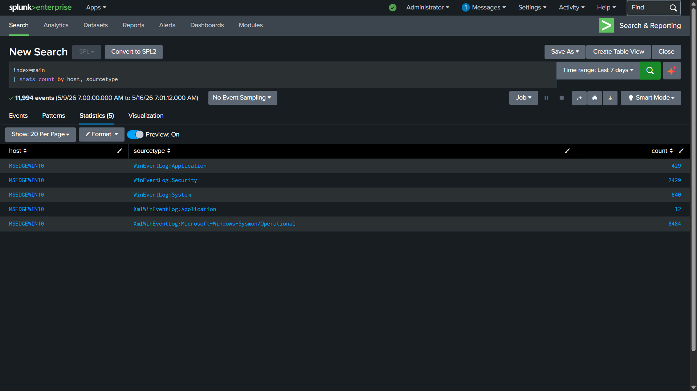
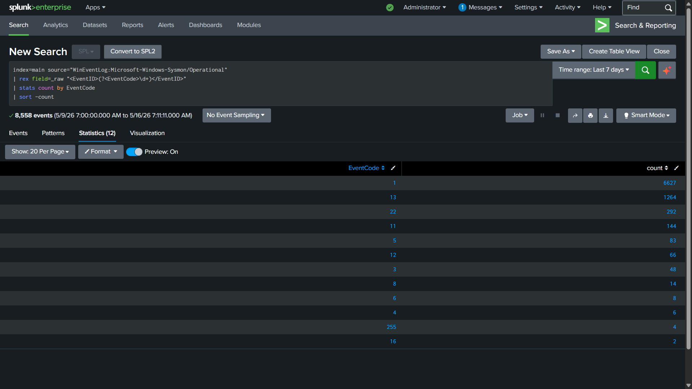
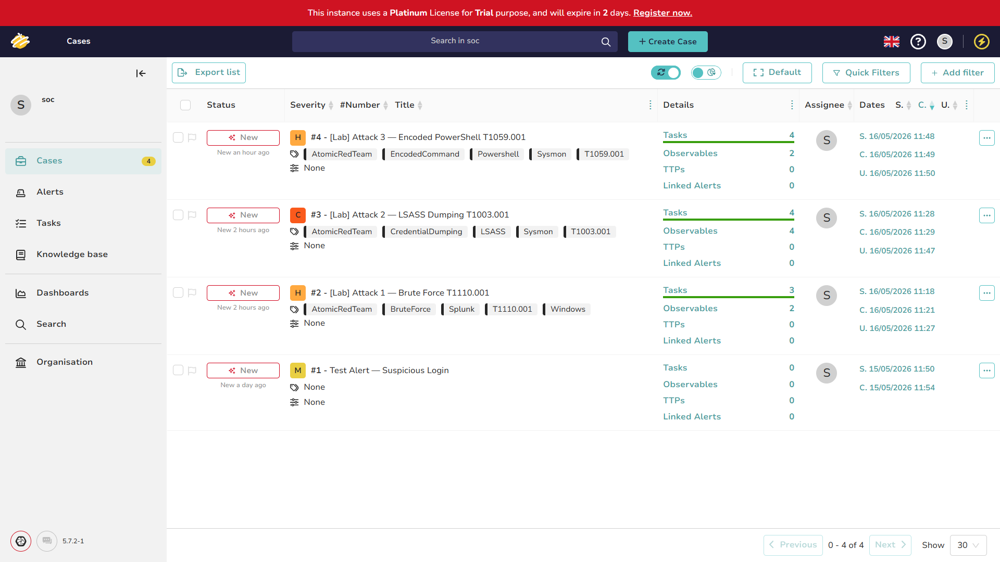

# Project 1 — Real Attack Detection with Splunk

## Overview

I used Atomic Red Team — an open-source framework that maps attack
simulations directly to MITRE ATT&CK techniques — to execute three
real attack techniques on my Windows 10 VM. Then I opened Splunk,
wrote SPL queries, confirmed the detections fired on
real telemetry, and documented everything as SOC cases in TheHive.

The goal was to understand what these attacks look like from the
defender's side. Reading that LSASS dumping is bad is one thing.
Seeing `procdump.exe -ma lsass.exe` appear in a Sysmon log with
PowerShell as its parent process is a different level of understanding.

---

## Lab Architecture


*Splunk showing logs arriving from the Windows 10 VM — proof the
pipeline is working before any attacks are run.*

| Machine | OS | IP | Role |
|---|---|---|---|
| Host | Windows 11 | — | Browser, analyst tools |
| SIEM | Ubuntu Server 22.04 | 192.168.xx.xxx | Splunk Enterprise |
| Target | Windows 10 | 192.168.xx.xxx | Attack target |
| IR | Kali Linux | 192.168.xx.xxx | TheHive (Docker) |

### Log Pipeline

```text
Windows 10 VM
├── Sysmon (SwiftOnSecurity config)
├── Splunk Universal Forwarder
├── Forwarding to Ubuntu Splunk Indexer (port 9997)
└── Searchable in Splunk Web (port 8000)
```
Every process creation, network connection, file write, and registry
change on the Windows 10 VM flows into Splunk in near real-time.
This is what enterprise EDR telemetry looks like before it reaches
a dedicated EDR platform.

### Sysmon Pipeline Verification


*Splunk showing Sysmon event types collected. Event ID 1 (Process Create)
is the most important for detecting the attacks in this project.*

---

## Why Sysmon Matters

Windows Security Event Logs alone are not enough for real SOC work.
A standard Windows 10 machine generates Event ID 4688 (process
creation) but without the full command line — just the process name.
That means you see `cmd.exe` launched but not what command it ran.

Sysmon fills this gap. With the SwiftOnSecurity configuration deployed,
every process creation includes:

- Full command line with all arguments
- Parent process name and command line
- File hashes (MD5, SHA256, IMPHASH)
- User and integrity level

Without Sysmon, the LSASS dump attack in this project would show
as `cmd.exe` started by `powershell.exe`. With Sysmon it shows:
`procdump.exe -ma lsass.exe C:\Windows\Temp\lsass_dump.dmp`.
That is the difference between noise and a finding.

---

## Attacks Simulated

| # | Attack | MITRE ID | Tactic | Severity |
|---|---|---|---|---|
| 1 | Brute Force via SMB | T1110.001 | Credential Access | Medium |
| 2 | LSASS Memory Dump | T1003.001 | Credential Access | Critical |
| 3 | Encoded PowerShell | T1059.001 | Execution | High |

---

## Attack 1 — Brute Force (T1110.001)

[→ Full write-up with detection](attack1_brute_force/README.md)

**What happened:** Atomic Red Team ran `net.exe` to attempt SMB
authentication against the local machine using the `net use` command.
No Active Directory existed in the lab so domain auth failed. But
the process creation telemetry was captured completely.

**SOC lesson:** You don't need the attack to succeed to detect it.
The attempt itself is the finding. Every failed authentication and
every suspicious process launch is evidence.

---

## Attack 2 — LSASS Credential Dump (T1003.001)

[→ Full write-up with detection](attack2_lsass_dump/README.md)

**What happened:** Atomic Red Team downloaded `procdump.exe` and
executed it against `lsass.exe` — dumping its memory to a file on
disk. This is the same technique Mimikatz uses (via a different
method) to steal credential hashes.

**SOC lesson:** This is in almost every enterprise intrusion chain.
Attacker gets initial access → dumps LSASS → has credential hashes →
moves laterally. If you can detect this step, you can stop the chain.

---

## Attack 3 — Encoded PowerShell (T1059.001)

[→ Full write-up with detection](attack3_encoded_powershell/README.md)

**What happened:** Ran `powershell.exe -EncodedCommand` with a
Base64-encoded payload. Sysmon captured the full command line
including the encoded string.

**SOC lesson:** Attackers encode commands to bypass defenses that
look for specific strings like "Invoke-Expression" or "DownloadString".
The detection doesn't need to decode the payload — it triggers on
the use of encoded execution itself, which is suspicious regardless
of what the payload does.

---

## TheHive — SOC Case Management


*All three attacks documented as SOC investigation cases in TheHive.
Each case has severity rating, MITRE ATT&CK tags, observables,
and completed analyst tasks.*

Each case contains:
- Investigation summary written as a triage note
- Observables (process names, command lines, file paths)
- MITRE ATT&CK technique tags
- Analyst tasks marked completed
- Evidence attached (Splunk screenshots)

This mirrors how a real SOC analyst documents findings — every
action recorded, every conclusion justified.

---

## Key Takeaways

**On log quality:** The hardest part of this project was not writing
detections — it was getting the right logs flowing into Splunk.
Sysmon's sourcetype is `XmlWinEventLog:Microsoft-Windows-Sysmon/Operational`
not `XmlWinEventLog`. That one detail broke searches for longer
than I'd like to admit.

**On failed attacks:** Several Atomic Red Team tests failed because
my lab has no Active Directory or domain controller. But the failed
attempts still generated telemetry — process launches, failed network
connections, command-line activity. Real attackers fail constantly
too. SOC analysts detect the attempt, not just the success.

**On understanding vs reading:** I had read about LSASS dumping
before this project. I understood it conceptually. But seeing
`procdump.exe -ma lsass.exe` in a Splunk event with `powershell.exe`
as the parent — with the exact file path where the dump was saved —
changed how I think about endpoint detection. The log IS the attack
story, written by the attacker's own tools.

---

## Files in This Project

- `lab_environment.md` — Full setup documentation
- `screenshots/` — All evidence screenshots
- `attack1_brute_force/` — T1110.001 write-up + SPL
- `attack2_lsass_dump/` — T1003.001 write-up + SPL
- `attack3_encoded_powershell/` — T1059.001 write-up + SPL