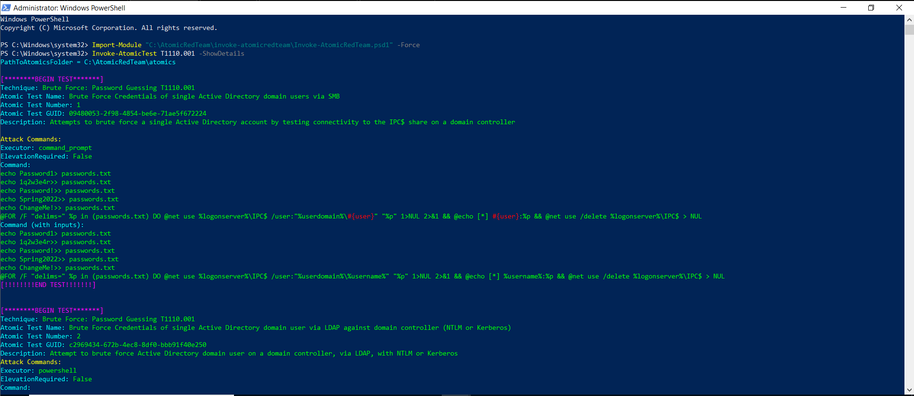
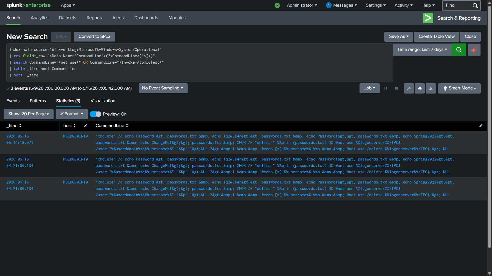

# Attack 1 — Brute Force: Password Guessing (T1110.001)

## MITRE ATT&CK Reference

| Field | Value |
|---|---|
| Technique | T1110.001 — Brute Force: Password Guessing |
| Tactic | Credential Access |
| Platform | Windows, Linux, macOS |
| Data Sources | Windows Security logs, Authentication logs |
| MITRE URL | https://attack.mitre.org/techniques/T1110/001/ |

---

## What This Attack Is

Brute force is exactly what it sounds like — trying many passwords
until one works. Attackers automate this against:

- **SMB shares** (using net.exe, Hydra, CrackMapExec)
- **RDP** (port 3389 — extremely common in ransomware initial access)
- **VPN gateways** (OWA, Citrix, Pulse Secure)
- **Web applications** (login forms, APIs)
- **Active Directory** (password spraying — one password, many users)

---

## How I Simulated It

**Tool:** Atomic Red Team, technique T1110.001

```powershell
Import-Module "C:\AtomicRedTeam\invoke-atomicredteam\Invoke-AtomicRedTeam.psd1" -Force
Invoke-AtomicTest T1110.001
```

**What Atomic Red Team actually ran:**
```
net use %logonserver%\IPC$ /user:DOMAIN\Administrator Password1
net use %logonserver%\IPC$ /user:DOMAIN\Administrator Password2
net use %logonserver%\IPC$ /user:DOMAIN\Administrator Password3
```

It attempted SMB authentication against the Windows domain IPC$
share using a list of common passwords. Since my lab has no Active
Directory or domain controller, authentication failed at the
infrastructure level. But the process execution and command-line
activity was fully captured by Sysmon.


*Atomic Red Team T1110.001 running on Windows 10. The output shows
the technique details and the net.exe commands being executed.*

---

## What the Logs Showed

- **Log source:** `WinEventLog:Microsoft-Windows-Sysmon/Operational`
- **Event ID:** 1 (Process Create)

Key fields captured by Sysmon:

| Field | Value |
|---|---|
| Image | `C:\Windows\System32\net.exe` |
| CommandLine | `net use %logonserver%\IPC$ /user:...` |
| ParentImage | `C:\Windows\System32\cmd.exe` |
| ParentCommandLine | launched by PowerShell (Atomic) |
| User | `MSEDGEWIN10\IEUser` |
| IntegrityLevel | High |
| Hashes | MD5, SHA256, IMPHASH recorded |

The IntegrityLevel field is important. `High` means the process ran with elevated privileges — administrator-level. Brute force tools running as admin can do significantly more damage if successful.

---

## Detection Query

```splunk
index=main source="WinEventLog:Microsoft-Windows-Sysmon/Operational"
| rex field=_raw "<Data Name='CommandLine'>(?<CommandLine>[^<]+)"
| rex field=_raw "<Data Name='Image'>(?<Image>[^<]+)"
| rex field=_raw "<Data Name='ParentImage'>(?<ParentImage>[^<]+)"
| search CommandLine="*net use*"
| eval mitre_technique="T1110.001 - Brute Force: Password Guessing"
| eval alert="Brute Force Attempt Detected"
| eval tactic="Credential Access"
| table _time host Image CommandLine ParentImage mitre_technique alert
| sort -_time
```


*Splunk detecting the brute force activity. The table shows Image,
CommandLine, and ParentImage — giving full context of what ran,
what command it used, and what launched it.*

---

## How to Read This Detection as an L1 Analyst

When this fires in a real SOC, here is the triage checklist:

**1. Who is the user?**
Is this a service account, a privileged admin, or a regular employee?
Brute force from a service account is extremely suspicious.

**2. What is the source host?**
Is this an internal workstation, a server, or something external?
`net use` running on a finance server at 3am is different from a
developer's laptop during business hours.

**3. How many attempts?**
One or two failed logins can be a mistyped password. Fifty failed
logins in two minutes is a brute force tool.

**4. Did any succeed?**
Search for EventCode 4624 (successful login) from the same source
IP within the same time window. This is the escalation trigger.

**5. What did the account do after?**
If a login succeeded, pivot to that account's activity immediately.
What files did they access? What processes did they launch?

---

## TheHive Case

- **Case title:** [Lab] Attack 1 — Brute Force T1110.001
- **Severity:** Medium
- **Status:** Resolved
- **MITRE tag:** T1110.001

## Triage note documented in TheHive:

> Atomic Red Team T1110.001 executed on MSEDGEWIN10 at [time].  
> net.exe observed attempting SMB authentication via net use IPC$.  
> No Active Directory present — authentication failed at infrastructure level. Process telemetry captured in Sysmon EID 1. Parent process was PowerShell indicating scripted/automated execution.  
> Disposition: True Positive (lab simulation). Detection validated.

---

## Full Detection Query File

[→ detection.spl](detection.spl)