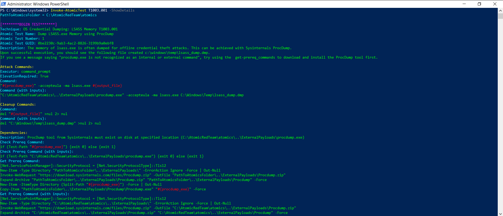
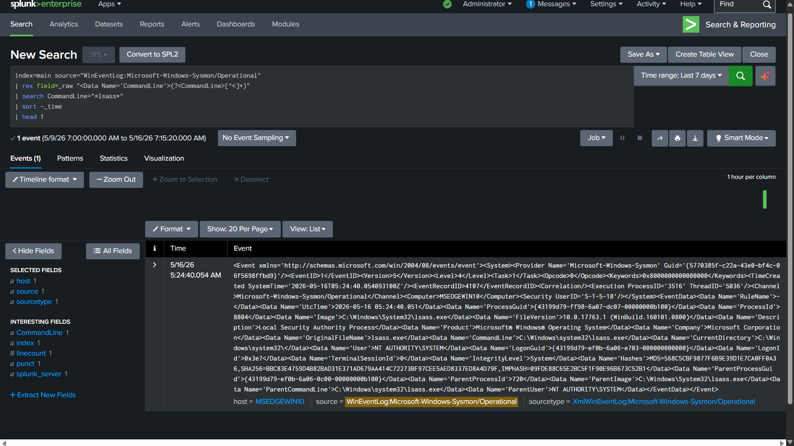
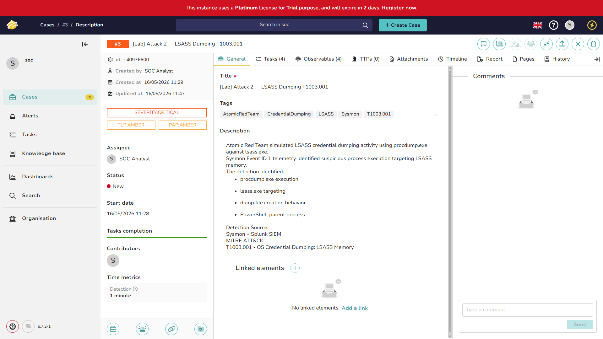

# Attack 2 — LSASS Memory Dump (T1003.001)

## MITRE ATT&CK Reference

| Field | Value |
|---|---|
| Technique | T1003.001 — OS Credential Dumping: LSASS Memory |
| Tactic | Credential Access |
| Platform | Windows |
| Data Sources | Sysmon EID 1, 8, 10 · Windows Security EID 4656 |
| MITRE URL | https://attack.mitre.org/techniques/T1003/001/ |


*MITRE ATT&CK technique page for T1003.001 — the reference
every detection should map back to.*

---

## What This Attack Is

LSASS stands for Local Security Authority Subsystem Service.
It is the Windows process responsible for enforcing security policy,
handling logins, and critically — holding credential material in
memory while users are logged in.

What credential material exactly?

- **NTLM password hashes** — usable for Pass-the-Hash attacks
  without knowing the actual password
- **Kerberos tickets** — usable for Pass-the-Ticket and
  Overpass-the-Hash attacks
- **Plaintext passwords** — in older or misconfigured systems
  with WDigest authentication enabled

When attackers dump LSASS memory, they get all of this. They can
then authenticate to other machines in the network as any user
whose credentials are cached — including Domain Admins.

**This is in almost every enterprise ransomware intrusion chain.**

The typical attack flow:

Phishing → Initial access → Local privilege escalation
→ LSASS dump → Credential theft → Lateral movement
→ Domain Admin → Ransomware deployment


Detecting LSASS access is one of the highest-value detections
a SOC team can have.

---

## Tools That Do This

- **Mimikatz** — the most famous, runs entirely in memory
- **procdump.exe** — legitimate Microsoft Sysinternals tool,
  abused to dump LSASS to disk
- **Task Manager** — yes, right-click → Create dump file
- **comsvcs.dll** — LOLBin method: `rundll32 comsvcs.dll MiniDump`
- **PPLdump, nanodump, HandleKatz** — modern evasion variants

In this lab I used the procdump method because it generates the
clearest Sysmon telemetry for learning purposes.

---

## How I Simulated It

**Tool:** Atomic Red Team, technique T1003.001

```powershell
Import-Module "C:\AtomicRedTeam\invoke-atomicredteam\Invoke-AtomicRedTeam.psd1" -Force
Invoke-AtomicTest T1003.001
```

**What Atomic Red Team actually executed:**

Atomic first downloaded `procdump.exe` from Microsoft Sysinternals,
then ran two variants:

1. Full memory dump (all pages)
- ```cmd.exe /c procdump.exe -ma lsass.exe C:\Windows\Temp\lsass_dump.dmp```

2. Mini dump (private pages only — smaller, still contains creds)
- ```cmd.exe /c procdump.exe -mm lsass.exe C:\Windows\Temp\lsass_dump.dmp```


Both commands ran with `cmd.exe` as the direct parent and
`powershell.exe` as the grandparent.


*Atomic Red Team T1003.001 executing on Windows 10. procdump.exe
is launched targeting lsass.exe. The command line arguments
(-ma, -mm) and output file path are visible.*

---

## What the Logs Showed

Two Sysmon event types captured this attack:

### Sysmon Event ID 1 — Process Create

This is the primary detection event.

| Field | Value |
|---|---|
| Image | `C:\Windows\System32\cmd.exe` |
| CommandLine | `procdump.exe -ma lsass.exe C:\Windows\Temp\lsass_dump.dmp` |
| ParentImage | `C:\Windows\System32\WindowsPowerShell\v1.0\powershell.exe` |
| User | `MSEDGEWIN10\IEUser` |
| IntegrityLevel | High |
| Hashes | SHA256=BC866C... (procdump hash — verifiable on VirusTotal) |

The command line alone is a definitive finding. There is no
legitimate reason for a standard user account to run
`procdump.exe` targeting `lsass.exe`.

### Sysmon Event ID 8 — CreateRemoteThread

Sysmon also captured thread injection INTO lsass from
`rdrleakdiag.exe` — a Windows memory diagnostic tool being
used as part of the dump process.

| Field | Value |
|---|---|
| SourceImage | `C:\Windows\System32\rdrleakdiag.exe` |
| TargetImage | `C:\Windows\System32\lsass.exe` |
| NewThreadId | 6084 |
| StartModule | `C:\Windows\SYSTEM32\ntdll.dll` |

A thread being created inside `lsass.exe` from an external process
is a high-confidence indicator of credential dumping.


*Raw Sysmon XML event in Splunk showing the full command line,
parent process chain, hashes, and user context. This is the
actual evidence preserved in a SOC investigation.*

---

## Detection Query

```splunk
index=main source="WinEventLog:Microsoft-Windows-Sysmon/Operational"
| rex field=_raw "<Data Name='CommandLine'>(?<CommandLine>[^<]+)"
| rex field=_raw "<Data Name='Image'>(?<Image>[^<]+)"
| rex field=_raw "<Data Name='ParentImage'>(?<ParentImage>[^<]+)"
| rex field=_raw "<Data Name='IntegrityLevel'>(?<IntegrityLevel>[^<]+)"
| search CommandLine="*lsass*" OR CommandLine="*procdump*"
| eval mitre_technique="T1003.001 - LSASS Memory Dump"
| eval tactic="Credential Access"
| eval severity="CRITICAL"
| eval analyst_note="Immediate escalation to L2. Check for lateral
  movement from this host. Isolate if confirmed malicious."
| table _time host Image CommandLine ParentImage IntegrityLevel
        mitre_technique severity analyst_note
| sort -_time
```

.png)
.png)
.png)
*Splunk detection query results. The table shows procdump.exe
in the CommandLine field with lsass.exe as the target, parent
process chain from PowerShell, and CRITICAL severity assigned.*

---

## How to Read This Detection as an L1 Analyst

When this fires in a real SOC, this is not a "needs investigation"
alert — this is an immediate escalation.

**Triage steps:**

**1. Confirm the process targeting lsass**
What is `Image`? If it is procdump, Task Manager, or anything
unexpected — this is real. If it is Windows Defender or your
EDR agent — this is a false positive.

**2. Check the parent process**
`procdump.exe` spawned by `powershell.exe` is a red flag.
`procdump.exe` spawned by `svchost.exe` during a scheduled
task would need more investigation.

**3. Check IntegrityLevel**
High integrity = administrator privileges. The attacker already
has local admin. Assume they are moving laterally next.

**4. Check if a dump file was created**
Look for `*.dmp` files in `C:\Windows\Temp\`, `C:\Users\*\AppData\`.
If a dump file exists and the host has network access, assume
exfiltration is possible.

**5. Isolate immediately**
Do not wait for L2. An active LSASS dump means credential theft
is in progress or complete. Every minute the host stays on the
network is a minute the attacker can use those credentials.

---

## TheHive Case

- **Case title:** [Lab] Attack 2 — LSASS Dump T1003.001
- **Severity:** Critical
- **Status:** Resolved
- **MITRE tag:** T1003.001


*TheHive case for the LSASS dump investigation. Observables include
the process names and file paths. Tasks document each investigation
step completed.*

## Triage note documented in TheHive:

- Atomic Red Team T1003.001 executed on MSEDGEWIN10. procdump.exe  
- ran with -ma and -mm flags targeting lsass.exe. Output written  
- to C:\Windows\Temp\lsass_dump.dmp. Parent process chain:  
- powershell.exe → cmd.exe → procdump.exe. Sysmon EID 8 also  
- captured rdrleakdiag.exe creating remote thread in lsass.exe.  
- IntegrityLevel High — elevated execution confirmed.  
- Disposition: True Positive (lab simulation). Detection validated.  
- In a real incident this would trigger immediate host isolation  
- and L2 escalation for credential reset across the environment.

---

## Full Detection Query File

[→ detection.spl](detection.spl)